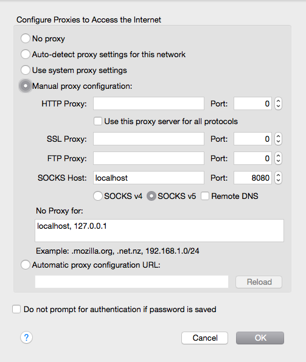

## Socks Proxy via SSH Tunnel

1. Configure ssh server on VPS or other Linux/UNIX server (search Google, plenty how-to's on that)
2. Configure FireFox to proxy all connections via localhost on port 8080
   - navigate to **Menu > Preferences > Advanced** then on the **Network** tab, click on **Settings**, copy the settings in Figure 1 below exactly as it is.

      

   - click **OK**

3. open Terminal in Mac or Linux computer
   - enter commands:
         ssh -N -D 8080 username@server.com

     **NOTE:** _Keep the terminal window open for the session to stay alive. If you close it, it will disconnect from the server._

4. **Profit**
   
